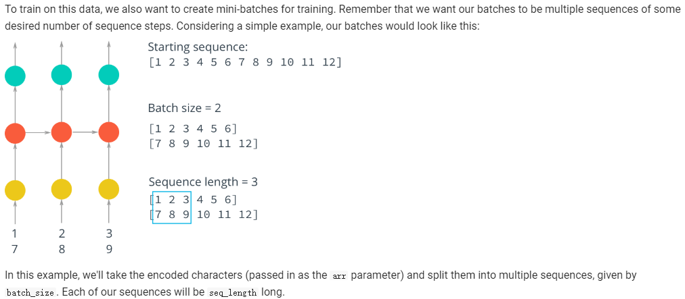
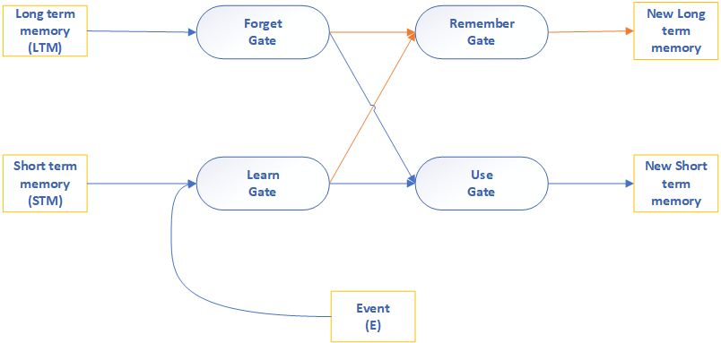
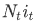
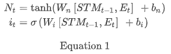
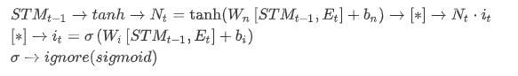
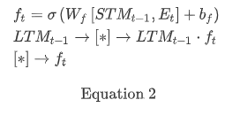
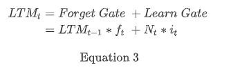
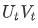
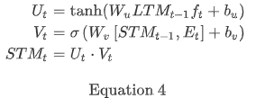
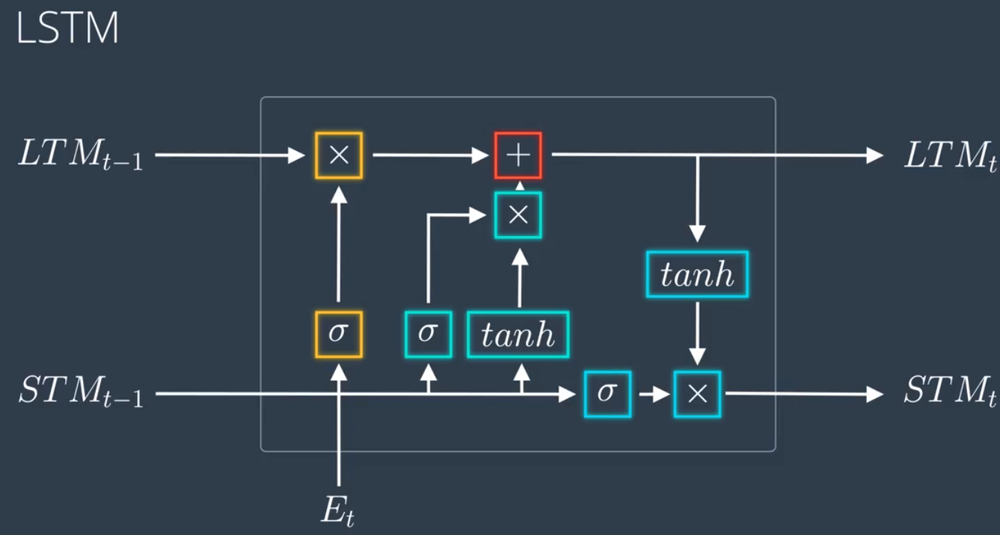

# NLP
---
## Content

- [RNN](#rnn)

- [LSTM](#lstm)
    - [LSTM ipyb](https://github.com/udacity/deep-learning-v2-pytorch/blob/master/recurrent-neural-networks/char-rnn/Character_Level_RNN_Solution.ipynb)

## RNN

For Pictures, In NLP, It needs to consider to the length.

reference
[udacity](https://github.com/udacity/deep-learning-v2-pytorch/blob/master/recurrent-neural-networks/char-rnn/Character_Level_RNN_Solution.ipynb)

## LSTM

---
For example:

### Step1

The output of the **Learn Gate** is  here:

Description:

### Step2

The output of the **Forget Gate** is  where:

### Step3

**Remember Gate**

### Step4

**Use Gate**

The output of the Use Gate is  where:

### Finally

### Reference

[Links](https://classroom.udacity.com/nanodegrees/nd188-bert/parts/a58738e5-e865-4f64-82e9-cbe7a41b272e/modules/67b445a1-38bc-4128-9d8b-58129e849573/lessons/a8fc0724-37ed-40d9-a226-57175b8bb8cc/concepts/f9f95dcb-bb0e-43d3-841c-9277c54207cb)

### Warning

Because github doesn't support latex, so I have made a original, which is latex math.

[reference](https://github.com/udacity/deep-learning-v2-pytorch/tree/master/recurrent-neural-networks/char-rnn)
[original](https://github.com/chajnoven/Deep-learning-Implement-notebook/blob/master/Notebook/NLP/original/README-original.md)

